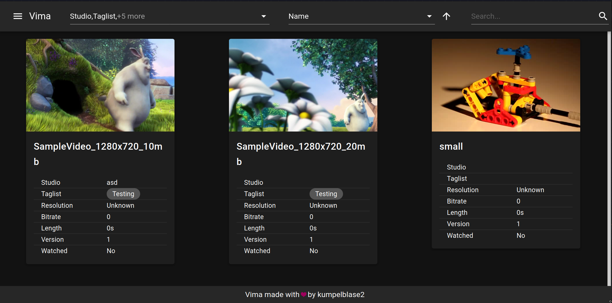

# vimax



Vimax is the successor to [Vima](https://github.com/kumpelblase2/vima/), but with a few different ideas in mind while the main
 use case stayed the same. To quote what Vima wanted to do:
 
> Vima is a video manager or video collection. It manages a set of videos and allows the user to define custom metadata for each video. The user can then search for specific videos via the specified metadata using a custom query language, create playlists the same way and obviously play the videos in their browser.

All of which is still true for Vimax. While I'm still OK with the decisions I've made, I wouldn't make them again with what I know
 now. Sadly though, these changes cannot be completely implemented in Vima, which is why we now have Vimax.

The reasons boil down to mostly high setup cost for users and bad maintainability of configuration. Ruby on Rails is a pain to
 deploy and run for a normal user compared to a simple binary or jar. This seems to be a general issue with interpreted 
languages and cannot really be fixed apart from providing packages for everyone, which is sadly not feasible for me.

Vima also required an existing mongodb database which is - again - annoying setup a user would have to do beforehand; not to 
mention that they'd have to maintain it. While mongo itself isn't the issue (I think it's one of the few use-cases where mongo
 _does_ make sense), there's no alternative document store which can run in-memory or can be started inside an application.

Lastly, the configuration wasn't really pleasant to work with. It was neither nice to work with from the user side nor was 
reacting to changes to it on the server side. A simple file doesn't provide the user any help with how it should be 
structured, what values can be used or what options he has available. It provided a lot of flexibility when initially developing
 the application but that came at a price. I no longer want to pay that price.

### So how is Vimax gonna fix these?

Vimax is written in a compiled language and will be provided as a single artifact (in this case: Jar). Secondly, it uses SQLite to
 store the data which doesn't require any setup from the user. Also, there will be no need to edit a config file as it would all
be done in the client.

## Plugins

To allow for providing automated metadata values as well as allowing the user to generate his own metadata values, Vimax - just 
like Vima - allows for adding plugins. Plugins in Vimax can do two things: declare their provided metadata and react to events 
to change the values of that metadata. Vimax already ships with three plugins: `Watched`, `Metadata` & `Version`. Plugins are
disabled by default and have to be enabled in the "Settings" page in the client. Once enabled, they'll take care of their 
metadata on their own and the metadata can be used to filter just like any other metadata.

You can also create your own plugins. Check out the [plugin information](PLUGINS.md) file in the repository for more information.

## Requirements

Java 8 (or later) needs to be installed on the system to run the application.
 
You need FFmpeg installed in the `PATH` of your system. FFmpeg is used to generate the thumbnails for the videos and to
 provide metadata like resolution or bitrate if the `MetadataInfoPlugin` is enabled.

For development purposes, you also need to have nodejs+npm installed.

## Installation
### Starting the application

Simply place the provided jar in any folder you like and start it using the following command (adjust the filename accordingly):
```shell script
java -jar vimax-1.2.jar --spring.profiles.active=production
```

This will start the application and once startup has finished, it should open the web interface in your preferred browser. If 
you don't want it to automatically open the browser, you can pass `--no-browser` at the end of the command to prevent it.

## Setting up

Now that we have the application running, there are some things we need to set up. 
1. Open application in your browser and
go to the settings tab using the menu on the left. You should see no libraries, but a couple of metadata and plugins. 
2. Enable wanted plugins. If you want to enable some plugins now, you can do that. However, you can also enable them later if
 you'd like. 
3. Configure any metadata you'd like to have. You can also do this later if you want.
4. Add a library by clicking the "Add library" button. This will open a dialog where you can specify the path of the library on
 the system. For example: `/home/tim/videos`. Save this library.

The system should now start importing the videos from that library and generate thumbnails. Depending on the amount of videos
 in the library, this may take a while.

## Developer Instructions
### How to start

To start the backend you can run:

```shell
./gradlew bootRun
# or if you're on windows
gradlew.bat bootRun
```

To then start the ui you have do multiple steps.
First, change into the `src/frontend` directory and then run the following:

```
npm ci
npm run serve
```

You can then access the UI on `localhost:8081`

### Building a release
To build a deployable archive you can simply run:
```bash
$ ./gradlew shadowJar
# or if you're on windows
$ gradlew.bat shadowJar
```
Which will generate a jar under `build/libs/vimax-*-all.jar`

## Configuration

While the goal was to never having to configure things in a file again I'm ignoring this goal for "application specific" 
configuration. In other words, any configuration that directly influences that application itself, not the content it manages.

For that, anyone can create a file called `application.properties` next to the jar. Since the application is built with spring, 
any of the properties provided by spring can be overwritten here, but also a few that are specifically provided by this 
application, namely:

```properties
# The relative directory where thumbnails will be saved. This is relative to the library location.
# Changing this will only affect newly generated thumbnails.
thumbnail-relative-dir=.thumbnails-new
# If it should continuously watch for added/removed files or if they should only be checked on startup
watch-files=true
# The relative directory where to load external plugins from
external-plugin-dir=./plugins
# The ffmpeg binary name (including path)
# If it is available in the $PATH environment, a path does not need to be specified
ffpmeg-binary=ffmpeg
# Similar to ffmpeg above, just for ffprobe
ffprobe-binary=ffprobe
```
